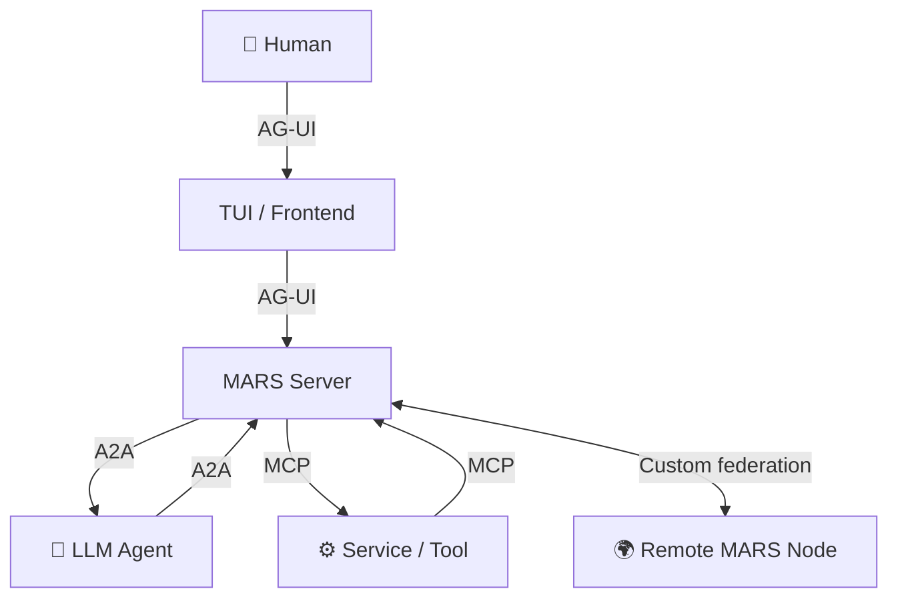
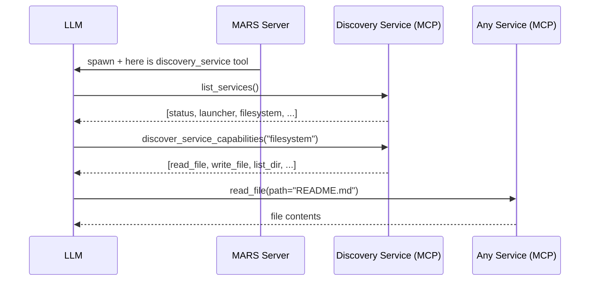
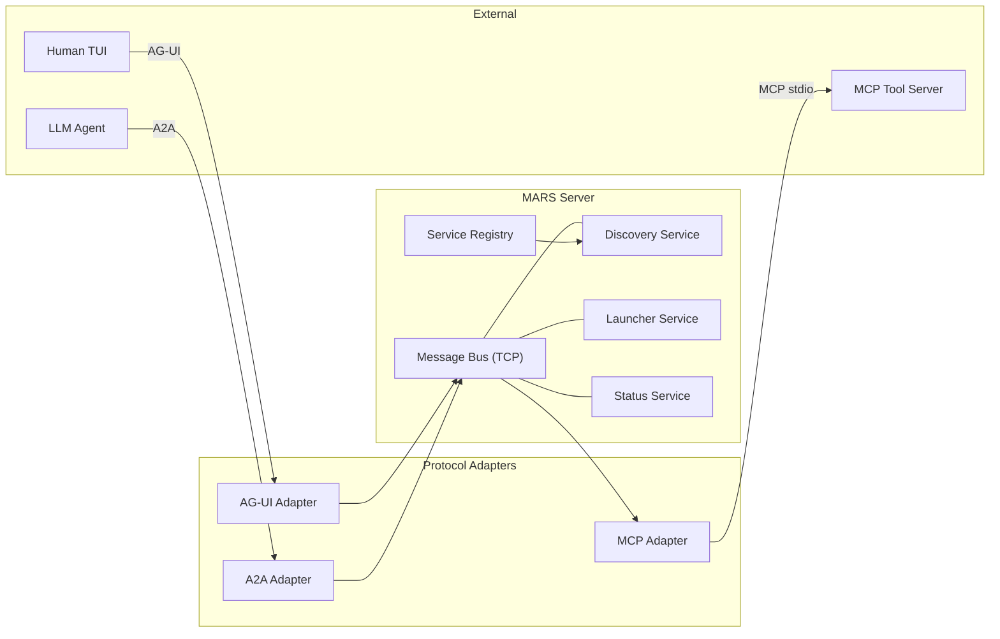

# 🌌 MARS — Multi-Agent Runtime System

MARS is a **minimal, standards-aligned multi-agent runtime** where humans and AI agents share one live message bus, discover each other's capabilities, and collaborate through open protocols.

## Core Design Principle

**Everything is a service.** Tools, LLMs, data sources, connections — all exposed as services with a consistent interface. Agents discover capabilities at runtime through the Discovery Service rather than being hard-wired to specific tools.

## Protocol Stack

MARS implements three open standards, each with a distinct responsibility:

| Layer | Protocol | Purpose |
|-------|----------|---------|
| Human ↔ Client | [AG-UI](https://github.com/ag-ui-protocol/ag-ui) | Event-based human-agent interaction |
| Agent ↔ Agent | [A2A](https://google.github.io/A2A/) | Agent interoperability and task delegation |
| Agent ↔ Tools | [MCP](https://modelcontextprotocol.io/) | Service discovery and tool invocation |
| MARS ↔ MARS | Custom | Node federation — no open standard exists yet |



### AG-UI — Human ↔ Client

> Spec: <https://github.com/ag-ui-protocol/ag-ui>  
> Docs: <https://docs.ag-ui.com/>

AG-UI is an open, lightweight, event-based protocol that standardises how AI agents connect to user-facing applications. MARS uses it for the channel between the human operator and the server so that any AG-UI-compatible frontend can connect.

### A2A — Agent ↔ Agent

> Spec: <https://google.github.io/A2A/>  
> SDK: <https://github.com/google/A2A>

A2A (Agent-to-Agent) is Google's open protocol for agent interoperability. It defines JSON-RPC 2.0 messaging, task lifecycle management, and Agent Cards for discovery. MARS uses A2A for all agent-to-agent communication.

### MCP — Agent ↔ Tools / Services

> Spec: <https://modelcontextprotocol.io/specification>  
> Python SDK: <https://github.com/modelcontextprotocol/python-sdk>

MCP (Model Context Protocol) is Anthropic's open standard for connecting AI agents to external tools and data sources. In MARS, **all tooling goes through MCP** — every service exposes its capabilities as MCP tools. Agents receive only the Discovery Service initially, then query for further tools at runtime.

### MARS Federation — MARS ↔ MARS

No open standard for runtime-to-runtime agent federation exists yet. MARS uses a custom TCP protocol with JSON framing for cross-node agent sharing. This will be revisited once a standard emerges.

## How Discovery Works

LLMs do not receive a full tool list at startup. They receive only the **Discovery Service**:



This keeps the context window small and lets services appear or disappear at runtime without re-prompting the LLM.

## Quick Start

Requires Python 3.14+.

```bash
# Terminal 1 — server (optionally pre-spawn an LLM agent)
python -m mars.server.main
python -m mars.server.main --provider ollama
python -m mars.server.main --provider ollama --model qwen3:4b

# Terminal 2 — TUI client
python -m mars.cli.main --remote 127.0.0.1:7432

# Or start both together (embedded mode)
python -m mars.cli.main --provider ollama
```

## Services

All services implement the `Service` interface (`service_id`, `capabilities`, `call_tool`, `initialize`, `shutdown`) and are exposed via MCP.

### Built-in Services (always started)

| Service | Description |
|---------|-------------|
| `discovery` | **Bootstrap service** — LLMs start here; returns all available services and their tools |
| `status` | Runtime introspection — agents, problems, activity |
| `launcher` | Spawn new LLM agents at runtime |
| `agent-comm` | Agent-to-agent messaging utilities |
| `cli` | CLI connection management |

### LLM Providers

| Provider | Notes |
|----------|-------|
| `ollama` | Local Ollama server |
| `anthropic` / `claude` | Anthropic Claude API |
| `copilot` | GitHub Copilot Chat |
| `mock` / `mock-tool` | Test-only — hidden from discovery |

### External Services (require configuration)

| Service | Notes |
|---------|-------|
| `filesystem` | MCP filesystem server (stdio) |
| `mcp-generic` | Generic MCP server adapter |
| `remote-mars` | A2A peer connection to remote MARS nodes |

## Architecture



## Project Layout

```
mars/
├── common/          # Shared: wire framing, models, state, constants
├── cli/             # TUI client (AG-UI consumer)
└── server/
    ├── server.py    # TCP message bus + routing
    ├── protocols/   # Protocol adapters: AG-UI, A2A, MCP, MARS
    ├── services/
    │   ├── builtin/ # Discovery, Status, Launcher, … (in-process)
    │   ├── llm/     # LLM wire agents (Ollama, Anthropic, Copilot)
    │   ├── mcp/     # MCP adapter + server wrappers
    │   └── a2a/     # A2A adapter
    └── federation.py  # MARS-to-MARS federation
```

## References

- AG-UI Protocol — <https://github.com/ag-ui-protocol/ag-ui>
- AG-UI Specification — <https://docs.ag-ui.com/>
- A2A Protocol — <https://google.github.io/A2A/>
- A2A Specification — <https://google.github.io/A2A/specification>
- MCP Specification — <https://modelcontextprotocol.io/specification>
- MCP Python SDK — <https://github.com/modelcontextprotocol/python-sdk>
