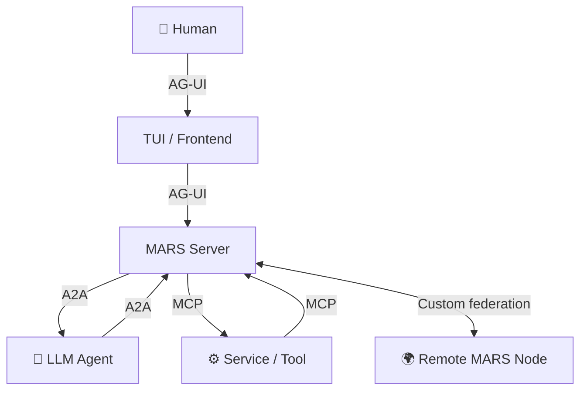
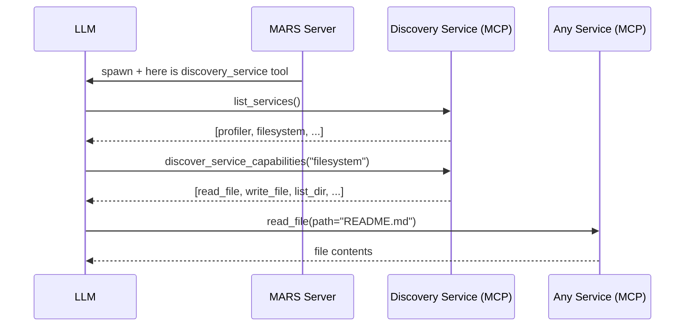
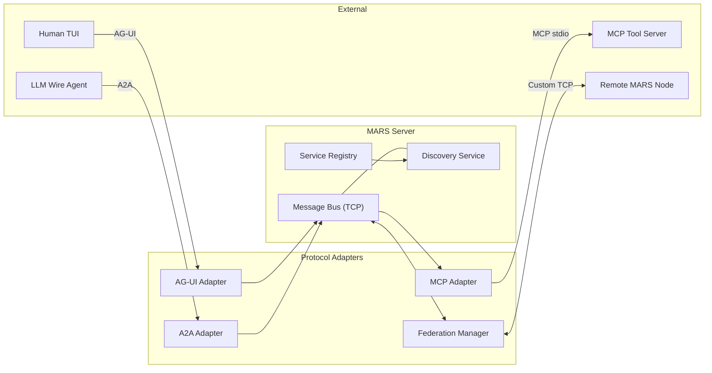

# 🌌 MARS — Multi-Agent Runtime System

MARS is a **minimal, standards-aligned multi-agent runtime** where humans and AI agents share one live message bus, discover each other's capabilities, and collaborate through open protocols.

## Core Design Principle

**Everything is a service.** Tools, LLMs, data sources, connections — all exposed as services with a consistent interface. Agents discover capabilities at runtime through the Discovery Service rather than being hard-wired to specific tools.

## Inspiration

MARS is grounded in academic research on living agent runtime systems and multi-agent coordination:

| Paper | Relevance |
|-------|-----------|
| [AgentLink — Living Agents Runtime System](papers/AgentLink_living_agents_runtime_system.pdf) | Core inspiration — persistent agents, service-oriented runtime, dynamic tool discovery |
| [EMIKA — System Architecture and Prototypic Realization](papers/EMIKA_System_Architecture_and_Prototypic_Realization.pdf) | Multi-agent system architecture and component model |
| [Agent-Based Counterparty Matching in Agent-Based Trading](papers/Agent-Based_Counterparty_Matching_in_Agent-Based_Trading.pdf) | Agent coordination and peer negotiation patterns |
| [Patient Technology for Impatient Patients](papers/Patient_Technology_for_Impatiently_Patients.pdf) | Applied multi-agent system in a domain context |
| [Method for Access to Location-Dependent Data](papers/Method_computer_and_computer_program_product_for_access_to_location_dependent_data.pdf) | Context-aware data access by agents |

## Protocol Stack

| Layer | Protocol | Purpose |
|-------|----------|---------|
| Human ↔ Client | [AG-UI](https://github.com/ag-ui-protocol/ag-ui) | Event-based human-agent interaction |
| Agent ↔ Agent | [A2A](https://google.github.io/A2A/) | Agent interoperability and task delegation |
| Agent ↔ Tools | [MCP](https://modelcontextprotocol.io/) | Service discovery and tool invocation |
| MARS ↔ MARS | Custom | Node federation — no open standard exists yet |



### AG-UI — Human ↔ Client

AG-UI is an open, lightweight, event-based protocol that standardises how AI agents connect to user-facing applications. MARS uses it for the channel between the human operator and the server so that any AG-UI-compatible frontend can connect.

> Spec: <https://github.com/ag-ui-protocol/ag-ui> · Docs: <https://docs.ag-ui.com/>

### A2A — Agent ↔ Agent

A2A (Agent-to-Agent) is Google's open protocol for agent interoperability. It defines JSON-RPC 2.0 messaging, task lifecycle management, and Agent Cards for discovery. MARS uses A2A for all agent-to-agent communication.

> Spec: <https://google.github.io/A2A/> · SDK: <https://github.com/google/A2A>

### MCP — Agent ↔ Tools / Services

MCP (Model Context Protocol) is Anthropic's open standard for connecting AI agents to external tools and data sources. In MARS, **all tooling goes through MCP** — every service exposes its capabilities as MCP tools. Agents receive only the Discovery Service initially, then query for further capabilities at runtime.

> Spec: <https://modelcontextprotocol.io/specification> · Python SDK: <https://github.com/modelcontextprotocol/python-sdk>

### MARS Federation — MARS ↔ MARS

No open standard for runtime-to-runtime agent federation exists yet. MARS uses a custom TCP protocol with JSON framing for cross-node agent sharing.

## How Discovery Works

LLMs do not receive a full tool list at startup. They receive only the **Discovery Service**:



This keeps the context window small and lets services appear or disappear at runtime without re-prompting the LLM.

## Quick Start

Requires Python 3.11+.

```bash
# Terminal 1 — server
python -m mars.server.main

# Terminal 2 — TUI client
python -m mars.cli.main --remote 127.0.0.1:7432

# Or: start both in one command (embedded mode)
python -m mars.cli.main --provider ollama
python -m mars.cli.main --provider ollama --model qwen3:4b
python -m mars.cli.main --provider zai --model glm-5.2
```

## Services

Two categories exist. **LLM Agents** are conversational inference backends. Everything else is an **MCP Service** — discovered and invoked through MCP protocol, regardless of whether it runs in-process, as a subprocess, or as a remote peer.

### LLM Agents

| Provider | Availability | Default model |
|----------|-------------|---------------|
| `ollama` | TCP probe to `localhost:11434` — run `ollama serve` | `qwen3:4b` |
| `copilot` | `gh auth login` or `COPILOT_API_KEY` env var | (auto) |
| `zai` | `ZAI_API_KEY` env var (GLM Coding Plan) | `glm-5.2` |

On connect, MARS queries each available provider for its model list. The services panel shows providers as expandable rows with a three-state dot:

- 🟢 **Green** — running (agent spawned)
- ⚫ **Grey** — available but not yet started
- 🔴 **Red** — unavailable (Ollama not running, no API key)

### MCP Services

| Service | Auto-start | Notes |
|---------|:----------:|-------|
| `discovery` | ✅ | Bootstrap service — LLMs receive this on spawn |
| `profiler` | — | Performance monitoring (`get_uptime`) |
| `filesystem` | — | MCP filesystem server — set `FILESYSTEM_PATH` or `FILESYSTEM_MCP_CMD` |
| `federation` | — | A2A peer connection to a remote MARS node — set `FEDERATION_PEER` |

Service dots follow the same scheme: green = running, grey = available/configured, red = not configured.

Federation dot additionally reflects connection state: grey when the federation server is listening with no peers, green when at least one peer node is connected.

## Environment Setup

```bash
cp .env.example .env
```

| Variable | Service | Notes |
|----------|---------|-------|
| `ZAI_API_KEY` | z.AI | From [z.ai](https://docs.z.ai/) — GLM Coding Plan |
| `COPILOT_API_KEY` | Copilot | Only needed if not using `gh auth login` |
| `FILESYSTEM_PATH` | filesystem | Root path for the MCP filesystem server |
| `FILESYSTEM_MCP_CMD` | filesystem | Custom command if not using the default `npx` server |

## TUI

### Panels

The TUI has three panels cycled with `Tab`:

| Panel | Content |
|-------|---------|
| **Services** (left) | LLM providers with expandable model lists, MCP services |
| **Chat** (centre) | Conversation feed and reply panel |
| **Connections** (right) | Active agents and their conversation partners |

Panel with green border = focused. Blue border = not focused. The chat input only accepts keystrokes when the chat panel is focused.

### Keyboard Shortcuts

| Key | Context | Action |
|-----|---------|--------|
| `Tab` | anywhere | Cycle panel focus |
| `↑` / `↓` | any panel | Scroll chat or navigate rows |
| `Enter` | services (model row) | Spawn that model as an agent |
| `Enter` | services (service row) | Activate / connect service |

### Commands

| Command | Description |
|---------|-------------|
| `/spawn <provider> [model]` | Start a new LLM agent — e.g. `/spawn ollama qwen3:4b` |
| `/stop <agent-id>` | Stop a running agent |
| `/switch <agent-id>` | Switch the active chat target |
| `/agents` | List running agents as a table |
| `/agents available` | List all known services and their status |
| `/status [agent-id]` | Show agent FSM state |
| `/verbose [agent-id]` | Toggle verbose tool-call output |
| `/avatar <emoji\|n>` | Set your avatar |
| `/new` | Clear the local conversation display |
| `/rewind` | Remove last message pair — client display and server history |
| `/compact` | Summarise history server-side, replace context with summary |
| `/context` | Estimate token count for current context window |
| `/read <file>` | Read a file into the reply panel |
| `/copy` | Copy last reply to clipboard |
| `/share [file]` | Export session to a markdown file |
| `/search <query>` | Search local chat history |
| `/ask <question>` | One-off question — not added to conversation history |
| `/plan <task>` | Ask for an implementation plan |
| `/instructions` | Load `AGENTS.md` / `CLAUDE.md` into agent system prompt |
| `/echo text\|md\|void` | Switch reply rendering mode |
| `/version` | Show MARS version |
| `/help` | Show command reference |
| `/quit` | Exit |
| `@file` | Inline-expand a file in your message |
| `!cmd` | Run a shell command, output in reply panel |

## Architecture



## Project Layout

```
mars/
├── common/              # Wire framing, models, state, constants
├── cli/                 # TUI client
│   ├── client.py        # Event loop, keyboard input, command dispatch
│   ├── commands.py      # /cmd implementations
│   ├── renderer.py      # Rich panel rendering (services, chat, connections)
│   └── nav.py           # Panel navigation + service row builder
└── server/
    ├── main.py          # Entry point
    ├── server.py        # TCP message bus + routing
    ├── federation.py    # MARS-to-MARS federation
    └── services/
        ├── registry.py      # Service factory + availability probes
        ├── base.py          # Service base class
        ├── builtin/         # Discovery, Profiler (in-process)
        ├── llm/             # LLM providers: Ollama, Copilot, z.AI, Mock
        ├── mcp/             # MCP adapter (stdio subprocess client)
        └── a2a/             # A2A adapter
```

## References

- AG-UI Protocol — <https://github.com/ag-ui-protocol/ag-ui>
- AG-UI Specification — <https://docs.ag-ui.com/>
- A2A Protocol — <https://google.github.io/A2A/>
- A2A Specification — <https://google.github.io/A2A/specification>
- MCP Specification — <https://modelcontextprotocol.io/specification>
- MCP Python SDK — <https://github.com/modelcontextprotocol/python-sdk>
- Ollama — <https://ollama.com/>
- z.AI API — <https://docs.z.ai/api-reference/introduction>
- GitHub Copilot API — <https://docs.github.com/en/copilot>
